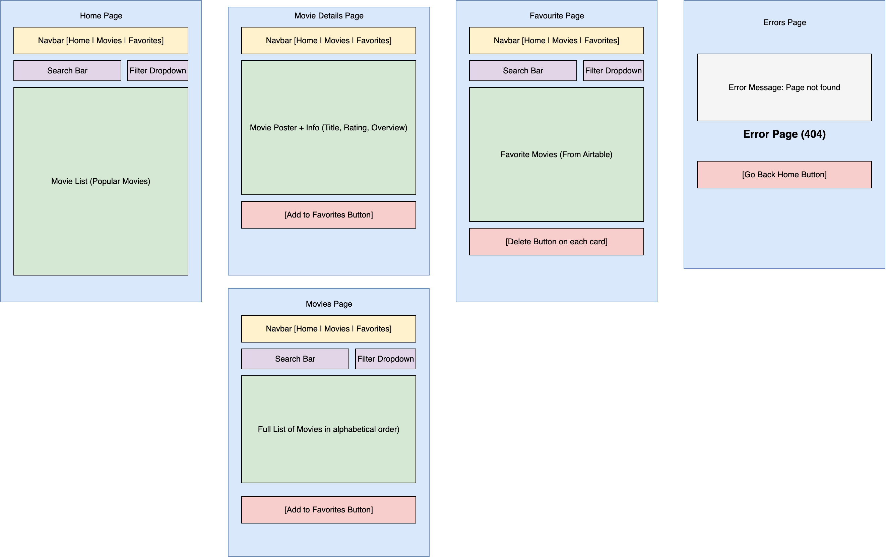

# 🎬 React Movie App

  

---

## 📝 Description

React Movie App is a modern web application that allows users to **search**, **view**, and **manage** movies using data fetched from **The Movie Database (TMDB) API**.

Users can browse movie details, add movies to a Favourites list, and manage their collection — all while experiencing a clean, responsive, and interactive UI built with React.

I built this project to strengthen my understanding of React fundamentals such as **useState**, **useEffect**, **React Router**, **props**, and **conditional rendering**, while also working with real-world APIs and data fetching.

---

## 🚀 Getting Started

### 🔗 Live Demo

[View Live on Vercel](https://react-movie-app-ten-sigma.vercel.app/)

### 📄 Planning Materials

---

## 🙌 Attributions

- Movie data and images provided by The Movie Database API (TMDB)

---

## 🎥 Features

- Movie Search — Search for movies using TMDB’s public API.
- Dynamic Results — Results update automatically with debounced search to reduce unnecessary API calls.
- Favorites Management — Add or remove movies from your favorites list (stored in Airtable).
- Movie Details Page — View detailed information including overview, genres, rating, and release date.

---

## ⚙️ Technologies Used

- React.js (Vite) — Component-based UI development

- React Router — Client-side routing and dynamic movie pages

- Airtable API — Persistent backend for managing favorites

- TMDB API — Source of movie data

- React Loader Spinner — For displaying loading animations

- Day.js — For clean and readable date formatting

- CSS Modules — Scoped styling for each component

---

## 🔮 Next Steps (Future Enhancements)

- 🎛️ Filtering — Allow users to filter movies by genre, rating, or release year

- 🌗 Light / Dark Mode — Toggle between light and dark themes for better UX

- 🔐 User Authentication — Add sign-up and login features for personalized movie lists

- 🧮 Pagination — Implement pagination for movie results for UI & UX

- 🔗 State in URL — Sync search queries states with the URL for better navigation

- 🧹 Input Validation — Add proper client-side validation to prevent empty or invalid search inputs
